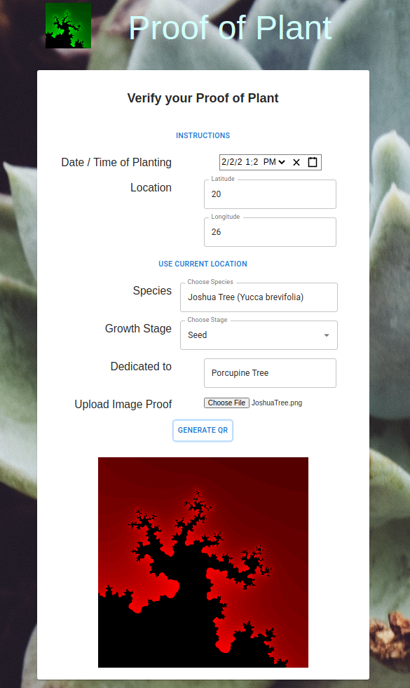
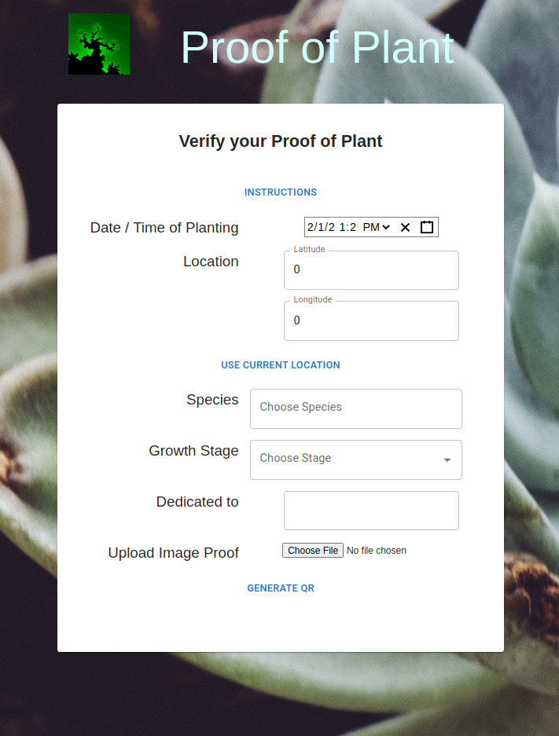
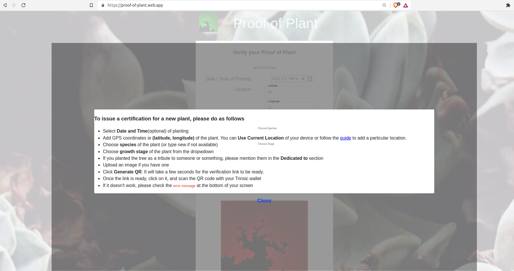
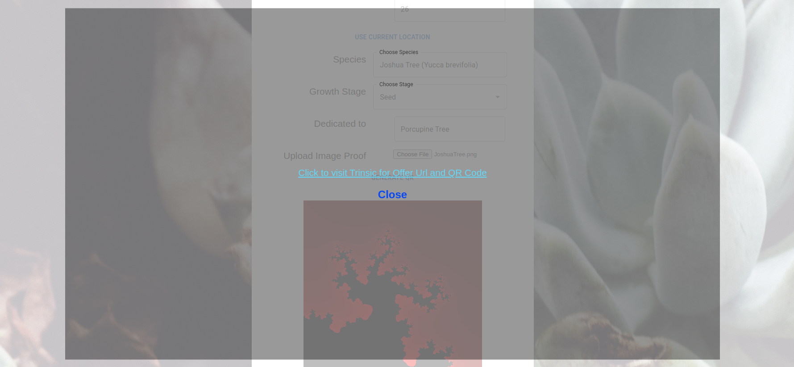
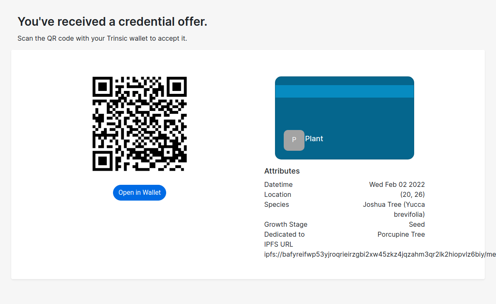
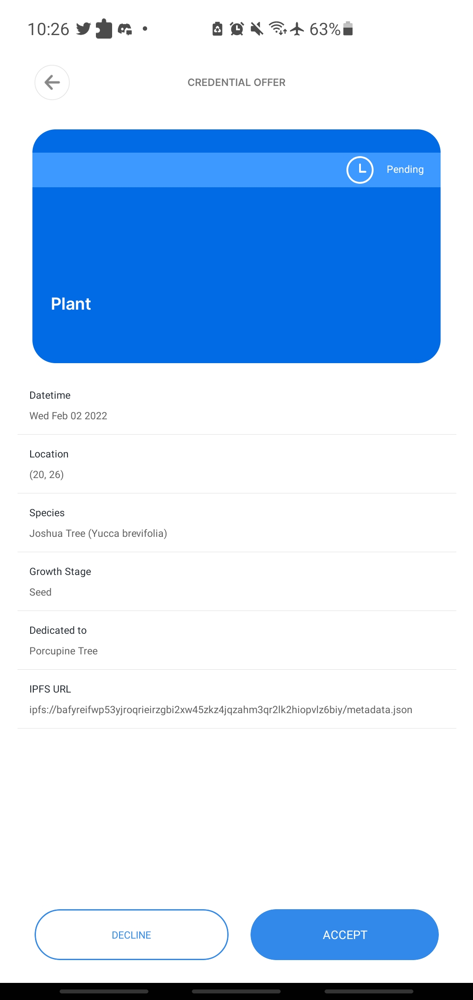

# Proof of Plant
As a Web3 Engineer interested in improving planetary resilience, working alongside a team of like minded people, Proof of Plant is an attempt to acknowledge and validate the actions like `planting a tree` by members of the community, using SSI based certification.

## Description
We need people to plant trees. To coordinate the efforts across the world, a blockchain based solution can be used to certify that trees were planted.The species of the tree and location are important to keep track of progress over time and preserve ecological balance. Date and time of planting is an important data point from verification and planning point of view. For example, if a lot of people are planting in a certain region at a certain time, they can be used for peer-to-peer certification, and to foster a local community.

For each plant, a minimal certification should store the following information
- Time and date of planting (YYYY/MM/DD HH:MM)
- Species (ICNafp)
- Location (Lat, Long in decimal degrees)
- Common Name

The scheme can be modified to include other relevant information.
- Age of the plant at the time of planting (0 years for seedlings)
- Plant picture with planter
- Endangered status

## Solutions
### v0.1
A decentralized serverless application without any verification. In this case, the submission is treated as public and valid, and can be used to generate a credential, and does not need any action from the developers / organization.

**Stack Components**
- Serverless frontend form (React)
- Trinsic API for QR code
- nft.storage to upload and access IPFS content
- Firebase deployment

**Workflow**
- Check instructions if needed
- Upload information for verification
- Store a copy on IPFS, get IPFS hash
- Create QR code from relevant information for certification
- Scan QR code on wallet

**Features**
- Calendar React component for date/time
- Geolocator for live location
- Species list for most common plants
- Image of the planting / the plant can be uploaded along with the information
- Metadata stored on IPFS, secure against centralized failures / failure of hyperledger

**Screens**

**Known Issues**
- [Material UI labels do not respect z-index]{https://github.com/mui/material-ui/issues/23499}
- Toggle modal bugs out when called too close to each other
- Trinsic API doesn't specify how QR code is generated, need to dig deeper

## Long term plans
- Build a Kanban / Jira / Trello board moving forward
- Additional Functionality
  - ML based species recognition from uploaded picture using Plant.id API
  - Integrated Google Maps widget for location 
  - Captcha or access control to avoid spurious certifications via bots
- Server-based solution for better security and performance
  - Hosted on AWS
  - Nodejs / Django backend with MongoDB
  - Verify submitted information
  - Data dashboard to aggregate statistics
  - Integrate analytics
- Android / IOS app 
  - Location data (maps API integration)
  - Image (camera API integration)
  - Trinsic SDK (currently in beta)
- Incentives and User Features
  - User dashboard
  - Achievements and Goals for individuals
  - Community Events
  - Display certification (with pictures maybe)
